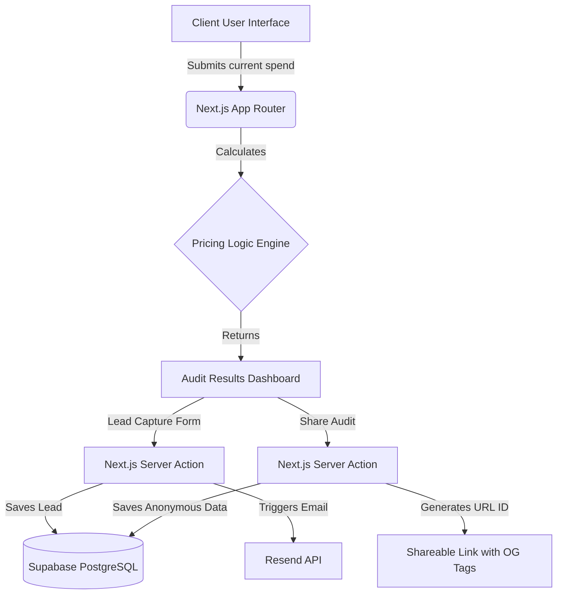

# Architecture

## System Diagram

## Stack Justification
- **Next.js (App Router)**: Chosen for its seamless integration of frontend UI and backend Server Actions. It allows us to securely execute Supabase queries and send emails without standing up a separate Express/Node server.
- **Supabase**: A Postgres-backed BaaS that gives us an instant database, easy Row Level Security (RLS) in the future, and zero-configuration scaling for our initial launch.
- **Tailwind CSS + shadcn/ui**: Critical for executing the high-fidelity, "Mint for AI" aesthetic quickly. shadcn/ui provides accessible primitives without the bloat of traditional component libraries.

## Scaling Plan for 10k Audits/Day
Currently, the app performs calculations entirely on the client or server without heavy processing.
If traffic scales to 10k audits per day:
1. **Edge Caching**: We will cache the static assets and the landing page using Next.js Edge caching (Vercel or Cloudflare).
2. **Supabase Connection Pooling**: 10k audits/day is roughly 400 requests/hour. Supabase handles this natively, but we will enable PgBouncer connection pooling to ensure Server Actions don't exhaust database connections during traffic spikes.
3. **Async Email Queues**: Resend API calls inside Server Actions could become a bottleneck. We will offload the lead capture email trigger to an asynchronous background worker queue (e.g., Inngest or Upstash Kafka) to return a success response to the client immediately.
