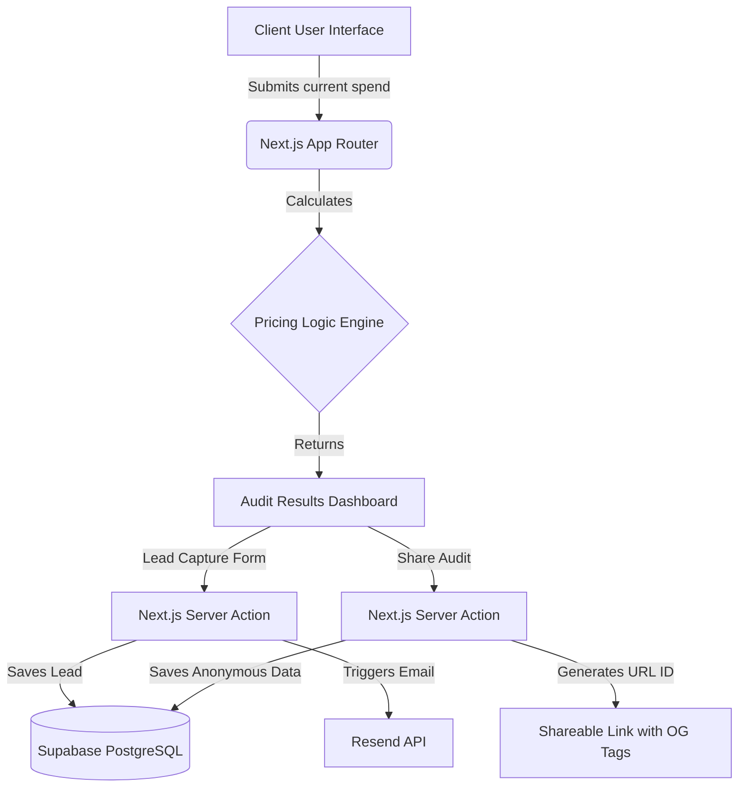

# 🏗️ Architecture & Stack Decisions

Here is a quick breakdown of how we built Credex and why we made these choices.

## How it works (The System Diagram)

## Why We Chose This Stack

When you're building a SaaS to test an idea, speed and builder experience are everything. Here's what we went with:

- **Next.js (App Router)**: Honestly, having the frontend and backend in one place is a superpower. Server Actions let us hit our database and fire off emails securely without dealing with the headache of setting up a separate Express server.
- **Supabase**: We needed a database *yesterday*. Supabase gives us a solid Postgres backend instantly. Plus, row-level security (RLS) is great for when we add user accounts later.
- **Tailwind CSS + shadcn/ui**: We wanted this tool to feel premium and trustworthy (think "Mint for AI"). Tailwind makes styling fast, and shadcn gives us great, accessible UI pieces without feeling bloated like older component libraries.

## 🚀 Preparing for Scale (10k Audits/Day)

Right now, the app is blazing fast because the math happens on the client or server without heavy processing. But if a big tech newsletter picks this up and we hit 10k audits a day, here is the game plan:

1. **Edge Caching**: We'll aggressively cache static assets and the landing page on the edge (via Vercel or Cloudflare).
2. **Supabase Connection Pooling**: 10k audits a day is only about 400 requests an hour. Supabase can eat that for breakfast, but we'll flip on PgBouncer connection pooling just to be safe so Server Actions don't exhaust DB connections during spikes.
3. **Async Email Queues**: Sending emails via Resend in Server Actions is fine for now, but it could get slow. Eventually, we'll offload those email triggers to a background worker (like Inngest or Upstash) so the UI stays snappy for the user.
